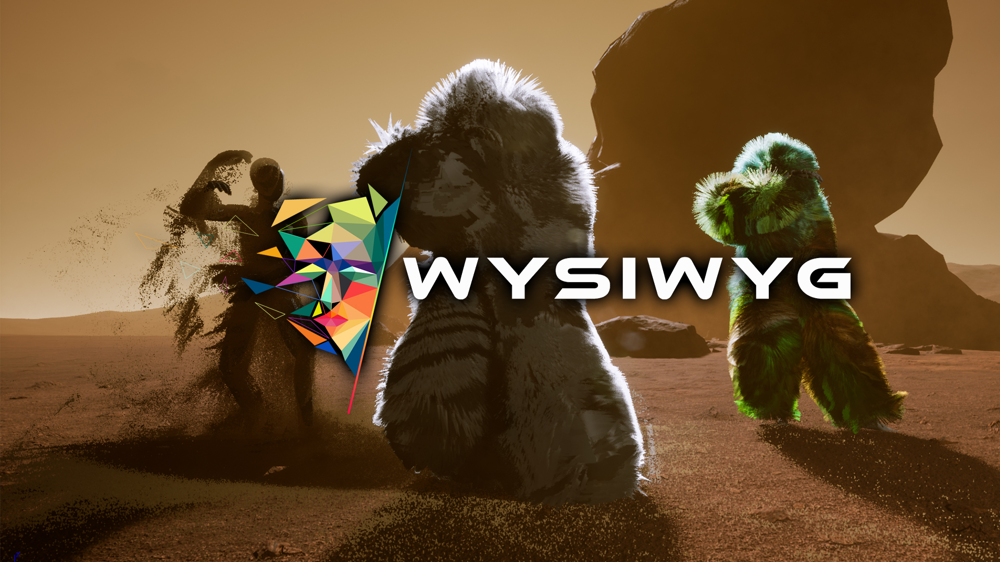

# WYSIWYG_VR_UE4.27_Theatre_Project
 Version 1.0

<!-- PROJECT LOGO -->
 

  

<h3 align="center">WYSIWYG - Virtual Production in Independent Performing Arts</h3>

  

    project_description
     
    <a href="https://github.com/github_username/repo_name"><strong>Explore the docs »</strong></a>
     
     
    <a href="https://github.com/github_username/repo_name">View Demo</a>
    ·
    <a href="https://github.com/github_username/repo_name/issues">Report Bug</a>
    ·
    <a href="https://github.com/github_username/repo_name/issues">Request Feature</a>
  

<!-- TABLE OF CONTENTS -->

  
Table of Contents

  <ol>
    <li>
      <a href="#about-the-project">About The Project</a>
      <ul>
        <li><a href="#built-with">Built With</a></li>
      </ul>
    </li>
    <li>
      <a href="#getting-started">Getting Started</a>
      <ul>
        <li><a href="#prerequisites">Prerequisites</a></li>
        <li><a href="#installation">Installation</a></li>
      </ul>
    </li>
    <li><a href="#usage">Usage</a></li>
    <li><a href="#roadmap">Roadmap</a></li>
    <li><a href="#contributing">Contributing</a></li>
    <li><a href="#license">License</a></li>
    <li><a href="#contact">Contact</a></li>
    <li><a href="#acknowledgments">Acknowledgments</a></li>
  </ol>

<!-- ABOUT THE PROJECT -->
## About The Project

This project is about the possibilities of virtual production in performing arts.

We create a virtual space and use a set up of different tools to enable a real time performance in VR. 

This is a very exciting journey, thought we are at the beginning of real time VR experiences as a new aesthetic experience. 
 
We present on this page different stages of the work and the tools we are working with and what virtual production can look like for performing arts. 

(<a href="#top">back to top</a>)

### Built With

* [Unrea Engine](https://www.epicgames.com/)
* [Rokoko Smartsuit Pro](https://www.rokoko.com/)
* [Blender](https://www.blender.org/)
* [OSC](https://de.wikipedia.org/wiki/Open_Sound_Control)
* [Lemur](https://liine.net/en/products/lemur/)
* [Oculus Quest 2](https://www.oculus.com/quest-2/)

(<a href="#top">back to top</a>)

<!-- GETTING STARTED -->
## Getting Started

This is an example of how you may give instructions on setting up your project locally.
To get a local copy up and running follow these simple example steps.

### Prerequisites

### Installation

(<a href="#top">back to top</a>)

<!-- USAGE EXAMPLES -->
## Usage

Use this space to show useful examples of how a project can be used. Additional screenshots, code examples and demos work well in this space. You may also link to more resources.

_For more examples, please refer to the [Documentation](https://example.com)_

(<a href="#top">back to top</a>)

